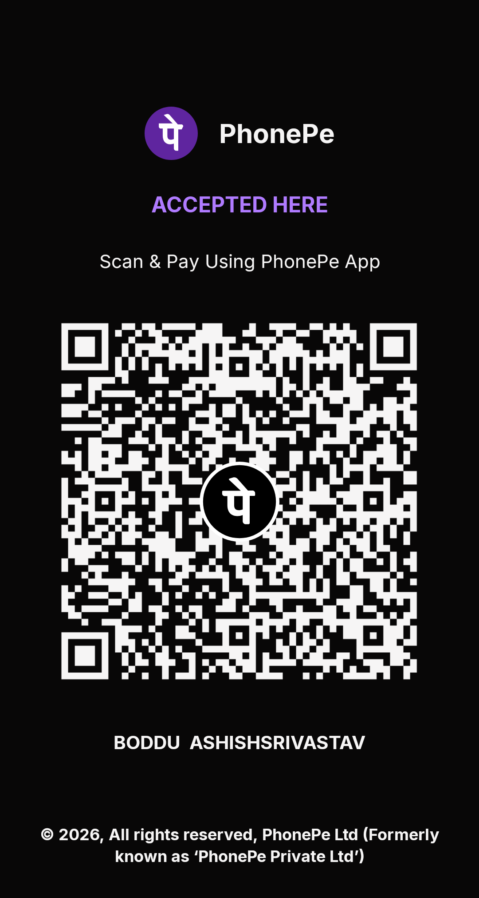

  

<h1 align="center">Vibe</h1>

  <b>A Discord-style, end-to-end encrypted messenger for Android, built on Matrix.</b> 
  No phone number. No ads. Open source.

  <a href="https://github.com/blackshadowde/Vibe-flutter/releases/latest"><b>⬇ Download the latest APK</b></a>
  ·
  <a href="#support-vibe">❤ Support Vibe</a>

---

## Why Vibe

Vibe is a private chat app for family and friends. It runs on [Matrix](https://matrix.org), the open, decentralised chat network, so you can talk to anyone on any Matrix server, like matrix.org, Unredacted or Mozilla, and no single company owns your account.

It looks and feels like Discord: a rail of profile pictures on the left, your DMs in the middle, and chats that slide over the top.

## Features

**Chat**
- End-to-end encrypted direct messages, with recovery key backup
- Replies with Discord-style curved lines and swipe-to-reply
- Animated reactions for every emoji
- Starred messages, pinned chats, edits and read receipts
- Media slideshow for every photo and video in a chat
- Share phone contacts and Matrix contacts
- Send big files in parts (Vibe to Vibe)

**Made for real life**
- 💭 **Custom status** with "Clear after", e.g. "⚓ On watch · until 4 PM"
- 🕓 **Their time:** see the other person's local time in a bubble at the top of the chat
- 🗓 **Send later:** schedule a message for their morning
- ⏱ **Disappearing messages** per chat, from 1 hour to 90 days
- 📶 **Low data mode:** photos load only when tapped, smaller uploads
- 🔒 **Lock chats** behind your fingerprint, with hidden notifications

**Your choice**
- 🌐 Pick any Matrix server, or create an account right in the app
- 🔔 Notifications through Firebase, or **built-in without Google** (ntfy)
- 💾 Keep media on your phone and save photos to your gallery
- 🎨 Discord palette, GG Sans font, haptics and 120 Hz animations

## Download and install

1. Open the [latest release](https://github.com/blackshadowde/Vibe-flutter/releases/latest) on your Android phone.
2. Tap **`Vibe-x.y.z.apk`** to download it.
3. Open the file. If Android asks, allow **Install unknown apps** for your browser.
4. Sign in with your Matrix account, or tap **Create account**.

To update, install the new APK over the old one. Your chats stay.

Works on 64-bit Android phones (almost every phone from the last 7+ years).

## Support Vibe

Vibe is free, with no ads and no tracking. If you'd like to help pay for the notification server and development:

   
  <b>UPI:</b> <code>YOUR-UPI-ID@bank</code>

Thank you! ❤

## Privacy

- Messages and files are end-to-end encrypted. Your server only stores scrambled data.
- Vibe has no analytics and no ads.
- Push notifications only carry a room and event ID, never message text.
- Your account lives on the Matrix server you choose.

## For developers

Builds run on GitHub Actions, so no local setup is needed.

- **Vibe build:** debug build for testing (Actions > Vibe build)
- **Vibe release:** signed APK. Tick **Publish** to create a public GitHub Release.

Version numbers are `major.minor` from `pubspec.yaml` plus the build number, e.g. `2.0.41`.

Release secrets (Settings > Secrets and variables > Actions):

| Secret | What it is |
| --- | --- |
| `ANDROID_KEYSTORE_BASE64` | base64 of the signing keystore |
| `ANDROID_KEYSTORE_PASSWORD` | keystore password |
| `GOOGLE_SERVICES_JSON` | Firebase `google-services.json` (enables push) |

Optional repository variable `VIBE_PUSH_GATEWAY`: your own push gateway URL (for forks).

Keep the keystore backed up outside the repository. Without it, installed apps can't be updated.

## Credits and licence

Vibe is a fork of [FluffyChat](https://github.com/krille-chan/fluffychat) by Christian Kußowski and contributors, licensed under **AGPL-3.0-or-later**. Vibe keeps that licence; see `LICENSE`.
Matrix is an open standard from the [Matrix.org Foundation](https://matrix.org).

Keywords: Matrix client, Android messenger, Discord style chat, end-to-end encryption, E2EE, private messenger, no phone number, FluffyChat fork, Flutter.
